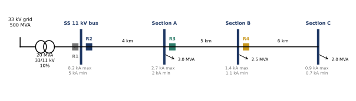
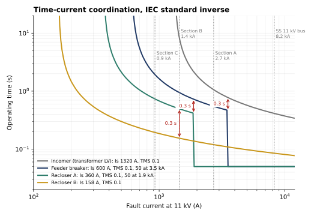

# Overcurrent Relay Coordination: 11 kV Distribution Feeder

[](https://github.com/fatinnihal532-hub/relay-coordination/actions/workflows/ci.yml)
[](https://colab.research.google.com/github/fatinnihal532-hub/relay-coordination/blob/main/run_in_colab.ipynb)

This repository calculates protection settings for a 33/11 kV substation and its radial 11 kV
overhead feeder, the kind of network distribution utilities run across Bangladesh. Four relays sit
in series: the transformer incomer, the feeder breaker and two line reclosers. The code chooses each
relay's CT ratio, pickup, time multiplier (TMS) and instantaneous setting so that the relay nearest a
fault always trips first. Each upstream relay waits at least 0.3 s longer, so it acts only as backup.



## Settings

| Relay | CT | Load | Pickup | Curve | TMS | Instantaneous (50) |
|---|---|---|---|---|---|---|
| R1 Incomer (transformer LV) | 1200/1 | 1050 A | 1320 A (1.10) | IEC SI | 0.11 | off |
| R2 Feeder breaker | 400/1 | 394 A | 600 A (1.50) | IEC SI | 0.12 | 3.53 kA |
| R3 Recloser A | 300/1 | 236 A | 360 A (1.20) | IEC SI | 0.10 | 1.88 kA |
| R4 Recloser B | 150/1 | 105 A | 158 A (1.05) | IEC SI | 0.05 | off |



## Method

1. **Fault levels.** The fault currents come from the ohmic impedances of the 33 kV source,
   the transformer and the ACSR Dog line sections. Maximum faults are three-phase at maximum plant
   with c = 1.1 (IEC 60909). Minimum faults are phase-to-phase at minimum plant with c = 1.0.
2. **Pickup.** Each pickup is at least 1.5× the load through the relay (1.25× transformer rating for
   the incomer). It is set in 0.05×CT plug steps on the smallest CT above the load current.
3. **Instantaneous elements.** Each 50 element is set at 1.3× the maximum fault at the next breaker,
   so it cannot reach past it. It is left off wherever it could never operate or could not
   discriminate. The incomer is one such case, because its zone ends at the same bus as the feeder
   breaker.
4. **Time multipliers.** Grading runs from the far end back to the source. Each relay is graded
   against the one downstream at two points. The first is the highest current on the downstream
   relay's inverse curve, just below its 50 setting. The second is the maximum fault, where the
   downstream relay trips instantaneously in 0.05 s. The TMS is rounded up to a 0.01 step.

## Results

* **Coordination holds everywhere.** Each pair was swept over every fault current it can see,
  from the smallest far-end fault to the largest close-in fault. The tightest margins are 0.311 s,
  0.310 s and 0.342 s, all above the 0.3 s target.
* **Close-in feeder fault (8.25 kA).** The feeder breaker clears it in 0.05 s through its
  instantaneous element. The incomer backs it up at 0.41 s.
* **Sensitivity.** The smallest fault in each zone is 3.0–4.5× that zone's pickup. The usual
  minimum is 1.5×, so every relay reliably sees the faults it must clear.
* **Curve choice.** The same feeder also coordinates with IEC very inverse and extremely inverse
  curves (the tests cover all three). Standard inverse is used here because it is the common default
  on utility feeders.

## How the results are checked

`python verify.py` runs 12 checks, and `pytest` runs 14 tests:

* the curves reproduce the IEC 60255 values at 10× pickup: 2.971 s (SI), 1.500 s (VI) and
  0.808 s (EI)
* the 11 kV bus fault equals a hand calculation of the source and transformer impedances
* **independent method:** solving all the TMS values at once by linear programming (scipy `linprog`)
  gives the same settings as the sequential grading
* rounding never lowers a TMS below the exact value
* no instantaneous element reaches past the next breaker
* a deliberately mis-set relay is detected as a coordination failure

## Run it

```bash
pip install -r requirements.txt
python -m pytest -q
python verify.py
python make_figures.py    # docs/*.svg and results/*.csv
```

To study another network, edit the source fault level, transformer, line lengths or loads in
[`relay/feeder.py`](relay/feeder.py). Pass `curve="VI"` or `"EI"` to `grade()` to try other curves.

## Layout

```
relay/curves.py        IEC 60255 inverse-time characteristics with a 50 element
relay/feeder.py        feeder model, maximum and minimum fault currents, load currents
relay/coordination.py  pickup, 50 and TMS grading; LP cross-check; margin sweep; sensitivity
verify.py              checks behind every number in this README
make_figures.py        single-line diagram, TCC plot and CSV tables
```

---
Fatin Nihal Islam · EEE, KUET · [Portfolio](https://fatinnihal532-hub.github.io) · [LinkedIn](https://www.linkedin.com/in/fatin-nihal-islam2002)
